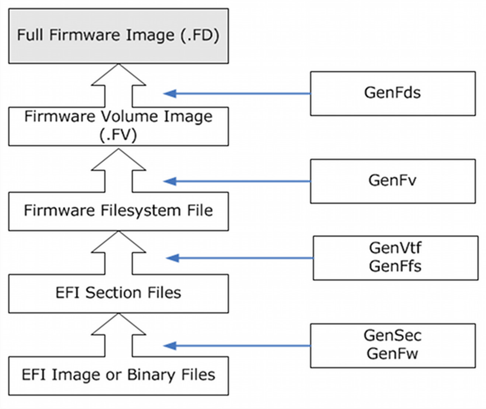

<!--- @file
  10.1 Overview of Flash Device Layout

  Copyright (c) 2008-2017, Intel Corporation. All rights reserved.<BR>

  Redistribution and use in source (original document form) and 'compiled'
  forms (converted to PDF, epub, HTML and other formats) with or without
  modification, are permitted provided that the following conditions are met:

  1) Redistributions of source code (original document form) must retain the
     above copyright notice, this list of conditions and the following
     disclaimer as the first lines of this file unmodified.

  2) Redistributions in compiled form (transformed to other DTDs, converted to
     PDF, epub, HTML and other formats) must reproduce the above copyright
     notice, this list of conditions and the following disclaimer in the
     documentation and/or other materials provided with the distribution.

  THIS DOCUMENTATION IS PROVIDED BY TIANOCORE PROJECT "AS IS" AND ANY EXPRESS OR
  IMPLIED WARRANTIES, INCLUDING, BUT NOT LIMITED TO, THE IMPLIED WARRANTIES OF
  MERCHANTABILITY AND FITNESS FOR A PARTICULAR PURPOSE ARE DISCLAIMED. IN NO
  EVENT SHALL TIANOCORE PROJECT  BE LIABLE FOR ANY DIRECT, INDIRECT, INCIDENTAL,
  SPECIAL, EXEMPLARY, OR CONSEQUENTIAL DAMAGES (INCLUDING, BUT NOT LIMITED TO,
  PROCUREMENT OF SUBSTITUTE GOODS OR SERVICES; LOSS OF USE, DATA, OR PROFITS;
  OR BUSINESS INTERRUPTION) HOWEVER CAUSED AND ON ANY THEORY OF LIABILITY,
  WHETHER IN CONTRACT, STRICT LIABILITY, OR TORT (INCLUDING NEGLIGENCE OR
  OTHERWISE) ARISING IN ANY WAY OUT OF THE USE OF THIS DOCUMENTATION, EVEN IF
  ADVISED OF THE POSSIBILITY OF SUCH DAMAGE.

-->

## 10.1 Overview of Flash Device Layout

The **GenFds** tool is typically called after a platform build's $(MAKE) Stage
completes. The **build.exe** command will call **GenFds**. The **GenFds**
program can also be executed by the developer from the command line.

In order to execute from the command-line, the tool needs to have its
environment setup. The following is an example of executing GenFds as a
stand-alone command.

```
GenFds -f $(WORKSPACE)\Nt32Pkg\Nt32Pkg.fdf \
  -o $(WORKSPACE)\Build\NT32\DEBUG_MYTOOLS -t MYTOOLS -b DEBUG -v \
  -p $(WORKSPACE)\Nt32Pkg\Nt32Pkg.dsc -a IA32
```

**GenFds**

calls several other tools during the generation of an FD image:

**GenSec**

This application is used to generate valid `EFI_SECTION` type files from
PE32/PE32+/ COFF image files or other binary files. The utility will attach a
valid section or PEIM header to the input file as defined in the PI
specification.

**GenFfs**

This application is used to generate FFS files for inclusion in a firmware
volume. Rules specified in the FDF file stipulate how the FFS file will be
organized (what kind of sections should reside in it and in what format).

**GenFv**

This application is used to generate FV image by taking what and how to place
FFS into it from the corresponding FV.inf file.

**GenFw**

This application is used to generate UEFI Firmware Image files based on
Component or Module types listed in the INF files from the PE/PE32+/COFF images
generated by the third party tool chains.

**GenVtf**

This application generates the Boot Strap File (AKA Volume Top File, or VTF)
for IA32 X64, and IPF images.

Figure 22 shows how the above tools involved in the GenFds process.



###### Figure 22 FD Image Generation Process
