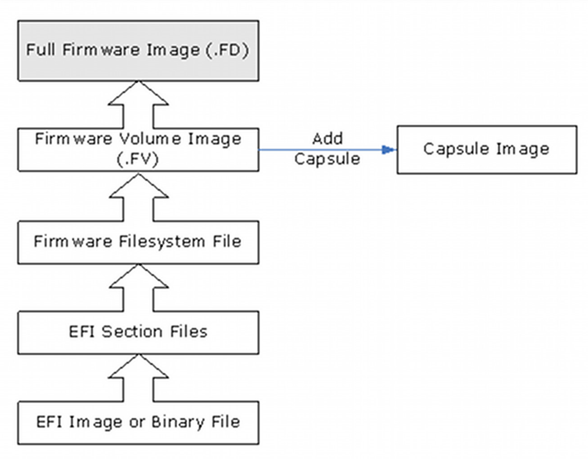

<!--- @file
  11.3 Capsules

  Copyright (c) 2008-2017, Intel Corporation. All rights reserved. 

  Redistribution and use in source (original document form) and 'compiled'
  forms (converted to PDF, epub, HTML and other formats) with or without
  modification, are permitted provided that the following conditions are met:

  1) Redistributions of source code (original document form) must retain the
     above copyright notice, this list of conditions and the following
     disclaimer as the first lines of this file unmodified.

  2) Redistributions in compiled form (transformed to other DTDs, converted to
     PDF, epub, HTML and other formats) must reproduce the above copyright
     notice, this list of conditions and the following disclaimer in the
     documentation and/or other materials provided with the distribution.

  THIS DOCUMENTATION IS PROVIDED BY TIANOCORE PROJECT "AS IS" AND ANY EXPRESS OR
  IMPLIED WARRANTIES, INCLUDING, BUT NOT LIMITED TO, THE IMPLIED WARRANTIES OF
  MERCHANTABILITY AND FITNESS FOR A PARTICULAR PURPOSE ARE DISCLAIMED. IN NO
  EVENT SHALL TIANOCORE PROJECT  BE LIABLE FOR ANY DIRECT, INDIRECT, INCIDENTAL,
  SPECIAL, EXEMPLARY, OR CONSEQUENTIAL DAMAGES (INCLUDING, BUT NOT LIMITED TO,
  PROCUREMENT OF SUBSTITUTE GOODS OR SERVICES; LOSS OF USE, DATA, OR PROFITS;
  OR BUSINESS INTERRUPTION) HOWEVER CAUSED AND ON ANY THEORY OF LIABILITY,
  WHETHER IN CONTRACT, STRICT LIABILITY, OR TORT (INCLUDING NEGLIGENCE OR
  OTHERWISE) ARISING IN ANY WAY OUT OF THE USE OF THIS DOCUMENTATION, EVEN IF
  ADVISED OF THE POSSIBILITY OF SUCH DAMAGE.

-->

## 11.3 Capsules

This section describes the processing of the EFI files generated by the $(MAKE)
Stage into Update Capsules. Capsule images contain a Fv Image or a FFS file to
be updated.

The `[Capsule]` section in FDF file is parsed to get:

* Capsule Header information, including: Capsule GUID, flags and header size.
* Capsule content may be either a Fv Image or a FFS file.

A Fv Image may be specified using any FV section described in this FDF file. It
will be generated same using the process described in Section 10.4.
Additionally, an existing FV file created as part of an FD image may be used.
These FV files can be directly integrated into a Capsule. Raw data (non-FFS
files) can be included in a FV file, using `EFI_FV_FILETYPE_RAW`.

The FFS file contains EFI section files (see Table 2 for a list of
`EFI_SECTION` types. All files generated by the $(MAKE) stage, will have the
output located in a build directory, either at the top of:
`$(OUTPUT_DIRECTORY)/$(PLATFORM_NAME)/<BuildTarget>_<ToolChainTag>/$(ARCH)`
or a sub-directory created that replicates the INF file path. All EFI section
files and encapsulated section files are created based on their description in
FDF file. For a binary or raw file type, the raw data can be any binary file.
One FV image or one FD image described in FV section or FD sections of the FDF
file may also be treated as RAW data. The process of creating a FV image is
described in Section 10.4, the process of creating a FD image is described in
Section 10.5.

The $(MAKE) stage creates EFI files. During the ImageGen stage, GenFds will
create the required FFS files and FV images based on `[Capsule]` description in
the FDF file. Finally, the capsule header will be prefixed to the capsule data
to construct the complete capsule. The overview of the Capsule creation process
is shown in Figure 23:

###### Figure 23 Capsule Creation Process.
