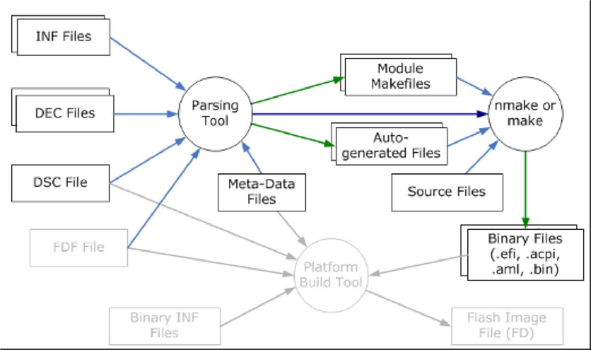

<!--- @file
  4.2 Build Process Overview

  Copyright (c) 2008-2017, Intel Corporation. All rights reserved. 

  Redistribution and use in source (original document form) and 'compiled'
  forms (converted to PDF, epub, HTML and other formats) with or without
  modification, are permitted provided that the following conditions are met:

  1) Redistributions of source code (original document form) must retain the
     above copyright notice, this list of conditions and the following
     disclaimer as the first lines of this file unmodified.

  2) Redistributions in compiled form (transformed to other DTDs, converted to
     PDF, epub, HTML and other formats) must reproduce the above copyright
     notice, this list of conditions and the following disclaimer in the
     documentation and/or other materials provided with the distribution.

  THIS DOCUMENTATION IS PROVIDED BY TIANOCORE PROJECT "AS IS" AND ANY EXPRESS OR
  IMPLIED WARRANTIES, INCLUDING, BUT NOT LIMITED TO, THE IMPLIED WARRANTIES OF
  MERCHANTABILITY AND FITNESS FOR A PARTICULAR PURPOSE ARE DISCLAIMED. IN NO
  EVENT SHALL TIANOCORE PROJECT  BE LIABLE FOR ANY DIRECT, INDIRECT, INCIDENTAL,
  SPECIAL, EXEMPLARY, OR CONSEQUENTIAL DAMAGES (INCLUDING, BUT NOT LIMITED TO,
  PROCUREMENT OF SUBSTITUTE GOODS OR SERVICES; LOSS OF USE, DATA, OR PROFITS;
  OR BUSINESS INTERRUPTION) HOWEVER CAUSED AND ON ANY THEORY OF LIABILITY,
  WHETHER IN CONTRACT, STRICT LIABILITY, OR TORT (INCLUDING NEGLIGENCE OR
  OTHERWISE) ARISING IN ANY WAY OUT OF THE USE OF THIS DOCUMENTATION, EVEN IF
  ADVISED OF THE POSSIBILITY OF SUCH DAMAGE.

-->

## 4.2 Build Process Overview

Prior to executing a build command, specific system environment variables must
be initialized: `WORKSPACE`, `EDK_TOOLS_PATH` are required for all builds,
while `ECP_SOURCE`, `EFI_SOURCE` and `EDK_SOURCE` are only required to build
EDK II platforms that contain EDK components and EDK libraries. Additionally,
the provided EDK II tool set must be present in a directory that is in the
system environment variable: PATH. The edksetup scripts provided in the root
directory of the EDK II development tree will set the `WORKSPACE` and
`EDK_TOOLS_PATH`, as well as modify the system environment variable, PATH to
ensure that the tools can execute. Refer to "_Build Environment_" for more
information.

Command-line options to the build command will override values defined in
meta-data files.

The EDK II Build Process is handled in three major stages:

* Pre-build or AutoGen stage: parse meta-data files, UCS-2LE encoded files and
  VFR files to generate some C source code files and the Makefiles.

* Build or $(MAKE) stage: process source code files to create PE32/PE32+/COFF
  images that are processed to EFI format using `NMAKE` (Microsoft operating
  system development platforms) or `MAKE` (for UNIX style operating system
  development platforms).

* Post-build or ImageGen stage: takes the binary, EFI format files and creates
  EFI "FLASH" images, EFI update capsules, UEFI applications or PCI Option ROMs.

Figure 18 shows the relationship of these three stages.

###### Figure 18 EDK II Platform Build Process Flow

**********
**Note:** In Figure 18, Meta-Data Files indicates build tool meta-data files:
`buildrule.txt`, `tools_def.txt`, `target.txt` and the like.
**********

The Build process is organized so that if a FLASH image file is not required,
such as in generating a Binary Module that will be distributed to other
end-users, stage three can be skipped. Drivers, Option ROM and/or UEFI
applications can also be distributed in this fashion.

**********
**Note:** The `Nt32Pkg` (`Nt32Pkg/Nt32Pkg.dsc`) emulation platform requires
Windows header files. In order to include Windows header files, execute the
`edk2setup.bat` utility with the **--nt32** option. This option will detect the
Microsoft Visual Studio installation and will execute it's setup command, for
example, `vsvars32.bat`.
**********
