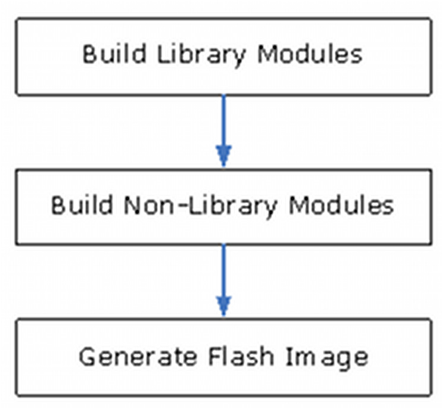
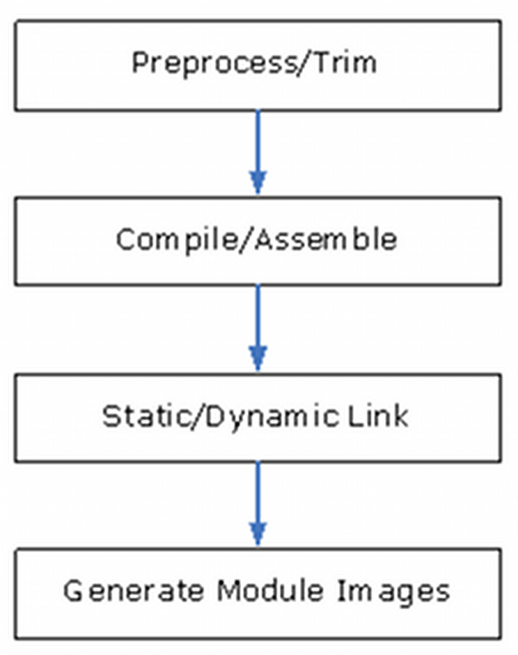

<!--- @file
  9.1 Overview

  Copyright (c) 2008-2017, Intel Corporation. All rights reserved.<BR>

  Redistribution and use in source (original document form) and 'compiled'
  forms (converted to PDF, epub, HTML and other formats) with or without
  modification, are permitted provided that the following conditions are met:

  1) Redistributions of source code (original document form) must retain the
     above copyright notice, this list of conditions and the following
     disclaimer as the first lines of this file unmodified.

  2) Redistributions in compiled form (transformed to other DTDs, converted to
     PDF, epub, HTML and other formats) must reproduce the above copyright
     notice, this list of conditions and the following disclaimer in the
     documentation and/or other materials provided with the distribution.

  THIS DOCUMENTATION IS PROVIDED BY TIANOCORE PROJECT "AS IS" AND ANY EXPRESS OR
  IMPLIED WARRANTIES, INCLUDING, BUT NOT LIMITED TO, THE IMPLIED WARRANTIES OF
  MERCHANTABILITY AND FITNESS FOR A PARTICULAR PURPOSE ARE DISCLAIMED. IN NO
  EVENT SHALL TIANOCORE PROJECT  BE LIABLE FOR ANY DIRECT, INDIRECT, INCIDENTAL,
  SPECIAL, EXEMPLARY, OR CONSEQUENTIAL DAMAGES (INCLUDING, BUT NOT LIMITED TO,
  PROCUREMENT OF SUBSTITUTE GOODS OR SERVICES; LOSS OF USE, DATA, OR PROFITS;
  OR BUSINESS INTERRUPTION) HOWEVER CAUSED AND ON ANY THEORY OF LIABILITY,
  WHETHER IN CONTRACT, STRICT LIABILITY, OR TORT (INCLUDING NEGLIGENCE OR
  OTHERWISE) ARISING IN ANY WAY OUT OF THE USE OF THIS DOCUMENTATION, EVEN IF
  ADVISED OF THE POSSIBILITY OF SUCH DAMAGE.

-->

## 9.1 Overview

From a platform point of view (remember, all builds are in the context of a
platform, even when the desired output may only be a driver), what will be done
in $(MAKE) stage includes building library modules, building non-library
modules and finally (if the desired output is a file to be burned into a flash
part on a physical platform) generating flash image(s).



###### Figure 20 EDK II Build Process - Platform Point of View (PoV)

From a module point of view, things done in $(MAKE) stage includes
preprocessing, compiling or assembling, static/dynamic linking and module image
generation.



###### Figure 21 EDK II Build Process - Module PoV

### 9.1.1 File Extensions for UEFI image files.

This section details the intermediate file extensions that generated by the
$(MAKE) stage of the build process. This stage involves processing source files
and generating dynamic objects which are further processed by the **GenFw** tool
to create .efi files.

###### Table 17 $(MAKE) Stage Intermediate Output File Extensions

| Extension | Description                                         |
|:---------:| --------------------------------------------------- |
| .obj      | Object files generated by $(MAKE) stage             |
| .lib      | Static Linked files generated by $(MAKE) stage      |
| .dll      | Dynamically Linked files generated by $(MAKE) stage |
| .aml      | ACPI code files generated by $(MAKE) stage          |
| .i, .iii  | Trim and C Pre-Processor output files               |
| .bin      | Microcode files                                     |

###### Table 18 $(MAKE) Stage Output File Extensions

| Extension   | Description                                                                                                                                                               |
|:-----------:| ------------------------------------------------------------------------------------------------------------------------------------------------------------------------- |
| .efi        | Non UEFI Applications, DXE Drivers, DXE Runtime Drivers, DXE SAL Drivers have the Subsystem type field of the DOS/TE header set to `EFI_IMAGE_SUBSYSTEM_EFI_APPLICATION`, `EFI_IMAGE_SUBSYSTEM_EFI_BOOT_SERVICE_DRIVER`, `EFI_IMAGE_SUBSYSTEM_EFI_RUNTIME_DRIVER` and `EFI_IMAGE_SUBSYSTEM_SAL_RUNTIME_DRIVER` respectively. |
|             | For a Security Module, the Subsystem type is set to `EFI_IMAGE_SUBSYSTEM_EFI_BOOT_SERVICE_DRIVER`.                                                                        |
|             | For `PEI_CORE`, `DXE_CORE`, `PEIM`, `DXE_SMM_DRIVER`, `UEFI_APPLICATION`, `UEFI_DRIVER`, the Subsystem type is set to `EFI_IMAGE_SUBSYSTEM_EFI_BOOT_SERVICE_DRIVER`.      |
| .acpi       | ASL or IASL compiled ACPI tables                                                                                                                                          |
| .depex      | Compiled dependency sections                                                                                                                                              |
| .mcb        | Microcode Binary files                                                                                                                                                    |

Additional modifications to the files are permitted. Modifications that
recommended are as follows:

```
TimeStructure can be modified to a given date using a data structure of
tm_mon,// months since January, [0,11]
tm_mday,// day of the month [1,31]
tm_year,// years since 1900
tm_hour,// hours since midnight [0,23]
tm_min,// minutes after the hour [0,59]
tm_sec,// seconds after the minute [0,59]
```

Subsystemfield is changed to one of the following:

```
EFI_IMAGE_SUBSYSTEM_UNKNOWN                  0
EFI_IMAGE_SUBSYSTEM_NATIVE                   1
EFI_IMAGE_SUBSYSTEM_WINDOWS_GUI              2
EFI_IMAGE_SUBSYSTEM_WINDOWS_CUI              3
EFI_IMAGE_SUBSYSTEM_OS2_CUI                  5
EFI_IMAGE_SUBSYSTEM_POSIX_CUI                7
EFI_IMAGE_SUBSYSTEM_EFI_APPLICATION          10
EFI_IMAGE_SUBSYSTEM_EFI_BOOT_SERVICE_DRIVER  11
EFI_IMAGE_SUBSYSTEM_EFI_RUNTIME_DRIVER       12
EFI_IMAGE_SUBSYSTEM_SAL_RUNTIME_DRIVER       13
```

The Machine value in the PE image file header is used to indicate the machine
code type of the image. The following values are set for UEFI images:

```
EFI_IMAGE_MACHINE_IA32  0x014C
EFI_IMAGE_MACHINE_IA64  0x0200
EFI_IMAGE_MACHINE_x64   0x8664
EFI_IMAGE_MACHINE_EBC   0x0EBC
```
