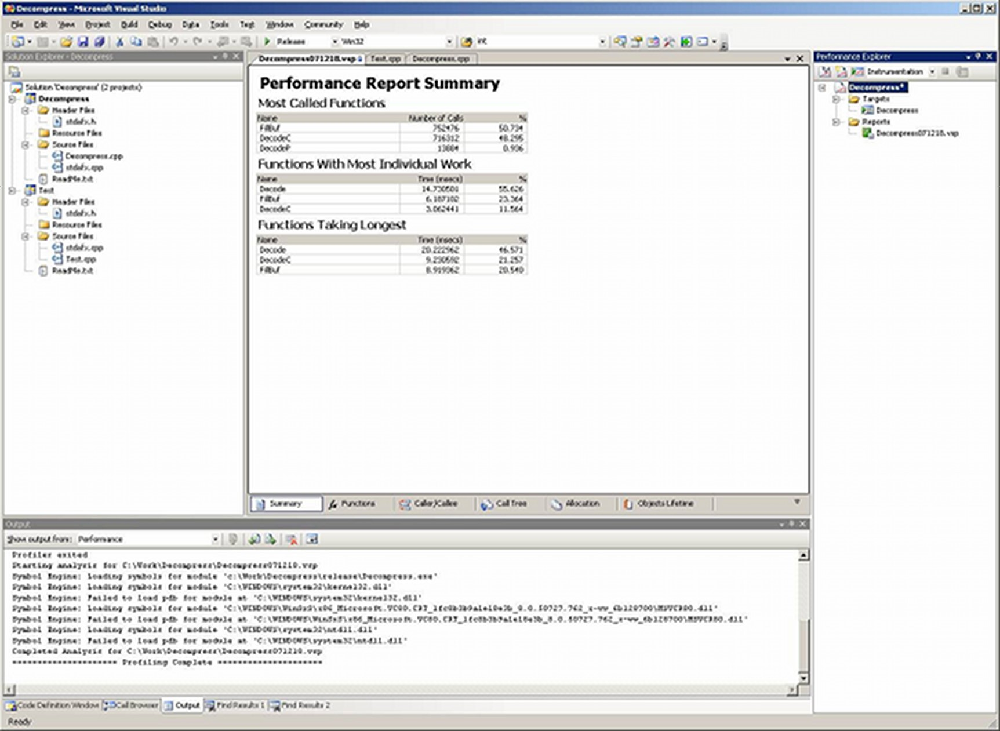
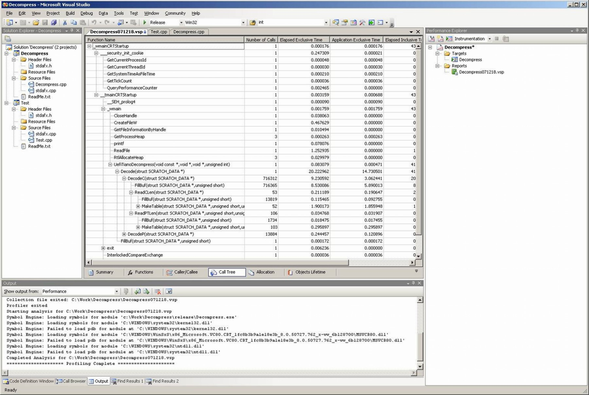

<!--- @file
  G.2 Step 2 - Update the project

  Copyright (c) 2008-2017, Intel Corporation. All rights reserved.<BR>

  Redistribution and use in source (original document form) and 'compiled'
  forms (converted to PDF, epub, HTML and other formats) with or without
  modification, are permitted provided that the following conditions are met:

  1) Redistributions of source code (original document form) must retain the
     above copyright notice, this list of conditions and the following
     disclaimer as the first lines of this file unmodified.

  2) Redistributions in compiled form (transformed to other DTDs, converted to
     PDF, epub, HTML and other formats) must reproduce the above copyright
     notice, this list of conditions and the following disclaimer in the
     documentation and/or other materials provided with the distribution.

  THIS DOCUMENTATION IS PROVIDED BY TIANOCORE PROJECT "AS IS" AND ANY EXPRESS OR
  IMPLIED WARRANTIES, INCLUDING, BUT NOT LIMITED TO, THE IMPLIED WARRANTIES OF
  MERCHANTABILITY AND FITNESS FOR A PARTICULAR PURPOSE ARE DISCLAIMED. IN NO
  EVENT SHALL TIANOCORE PROJECT  BE LIABLE FOR ANY DIRECT, INDIRECT, INCIDENTAL,
  SPECIAL, EXEMPLARY, OR CONSEQUENTIAL DAMAGES (INCLUDING, BUT NOT LIMITED TO,
  PROCUREMENT OF SUBSTITUTE GOODS OR SERVICES; LOSS OF USE, DATA, OR PROFITS;
  OR BUSINESS INTERRUPTION) HOWEVER CAUSED AND ON ANY THEORY OF LIABILITY,
  WHETHER IN CONTRACT, STRICT LIABILITY, OR TORT (INCLUDING NEGLIGENCE OR
  OTHERWISE) ARISING IN ANY WAY OUT OF THE USE OF THIS DOCUMENTATION, EVEN IF
  ADVISED OF THE POSSIBILITY OF SUCH DAMAGE.

-->

## G.2 Step 2 - Update the project

You will need to update the new project to support reading in input files and
writing data to an output file:

```c
#include "stdafx.h"
#include <windows.h>
include <stdio.h>

void
*Malloc (
  int  Size
  )
{
  return HeapAlloc (GetProcessHeap (), 0, Size);
}

int
_tmain (
  int     argc,
  _TCHAR  *argv[]
  )
{
  HANDLE                      hFile;
  HANDLE                      hOutFile;
  DWORD                       Error;
  DWORD                       BytesRead;
  BY_HANDLE_FILE_INFORMATION  FileInfo;
  void                        *Buffer;
  int                         Status;
  UINT32                      DestinationSize;
  VOID                        *Destination;

  Status = 0;
  printf ("test %d\n", argc);
  if (argc <= 1) {
    return 0;
  }

  hFile = CreateFile (
            argv[1],
            GENERIC_READ,
            FILE_SHARE_READ,
            NULL,
            OPEN_EXISTING,
            0,
            0
            );
  if (hFile == INVALID_HANDLE_VALUE) {
    Error = GetLastError ();
    return Error;
  }

  if (!GetFileInformationByHandle (hFile, &FileInfo)) {
    Error = GetLastError ();
    return Error;
  }

  if (FileInfo.nFileSizeHigh != 0) {
    // Assume input file is less than 4GB in size
    return 0;
  }

  Buffer = Malloc (FileInfo.nFileSizeLow);

  if (!ReadFile (hFile, Buffer, FileInfo.nFileSizeLow, &BytesRead, NULL)) {
    Error = GetLastError ();
    return Error;
  }

  // Process File ...
  // DestinationSize = ...
  // Destination = ...

  // If a 2nd argument exists it is a file name to write data to
  if ((argc >= 3) && (Status == 0)) {
    hOutFile = CreateFile (
                 argv[2],
                 GENERIC_WRITE | GENERIC_READ,
                 0,
                 NULL,
                 CREATE_ALWAYS,
                 FILE_ATTRIBUTE_NORMAL,
                 NULL
                 );
    if (hOutFile != INVALID_HANDLE_VALUE) {
      if (!WriteFile (hOutFile, Destination, DestinationSize, &BytesRead, NULL)) {
        Error = GetLastError ();
      }
      CloseHandle (hOutFile);
    }
  }

  CloseHandle (hFile);
  return 0;
}
```

### G.2.1 To pass an argument in to the console application

Do the following:

1. Update the `<project name>` Property Pages:
2. Right click on the `<project name>` in the Solution Explorer pain
3. Select preferences
4. In the configurations: window select All Configurations
5. In the left hand pain select Configuration Properties->Debugging
6. Under Command Arguments type in the command line. In my example the input
   file is compress and the output file is decompress.out

In this example compress is the EDK II NT32 FV (2.5MB) compressed to 707K.

So `decompress.out` must be 2.5MB NT32 FV.


###### Figure 25 VS2005 Property Page

This example required the EDK II Decompress Lib be ported into this environment
as follows:

1. Add EDK II EFI type definitions to get the EFI code to compile.
   ```c
   //
   // Map EFI types
   //
   typedef unsigned __int64  UINT64;
   typedef __int64           INT64;
   typedef unsigned __int32  UINT32;
   typedef __int32           INT32;
   typedef unsigned short    UINT16;
   typedef unsigned short    CHAR16;
   typedef short             INT16;
   typedef unsigned char     BOOLEAN;
   typedef unsigned char     UINT8;
   typedef char              CHAR8;

   #define UINT8_MAX  0xff
   ```

2. Convert EFI_STATUS/RETURN_STATUS to int and removed #defines for return
   values to make it easier for the code to compile.

3. Glue in the EFI code into _tmain()
   ```c
     // Process File
     Status = UefiDecompressGetInfo (
                Buffer,
                FileInfo.nFileSizeLow,
                &DestinationSize, &ScratchSize
                );
     if (Status == 0) {
       Destination = Malloc (DestinationSize);
       Scratch = Malloc (ScratchSize);

       if ((Scratch != NULL) && (Destination != NULL)) {
         Status = UefiTianoDecompress (Buffer, Destination, Scratch, 2);
         if (Status != 0) {
           printf ("Decompress Failed");
         }
       }
     }
   ```

### G.2.2 Step 3 Run the Performance Wizard

1. Tools->Performance Tools->Performance Wizard...
2. Make sure your project is selected and hit Next
3. When you are asked what method of profiling would like to use select
   Instrumentation.
   * The default is Sampling so you must change this
4. Then type Finish
5. A Performance Explorer pain will show up.
6. Right click on you project name and select Launch
   * This will rebuild your application with performance infrastructure.
   * Under Reports you will see a `<Project Name>[date].vsp` file that contains
     the info

Make sure you profile in the Release build and not the Debug build for best
results.

The following is an example of the output you will see.



###### Figure 26 VS2005 Performance Summary

From the summary, it appears that Decode() must have a very hot loop in it.
DecodeC and FillBuf are very simple, but they are called so many times a very
small improvement will be multiplied by 100,000.

Expanding the call tree view can be very useful.



###### Figure 27 VS2005 Call Tree View

Definition of terms http://msdn2.microsoft.com/en-us/library/ms242753(VS.80).aspx
